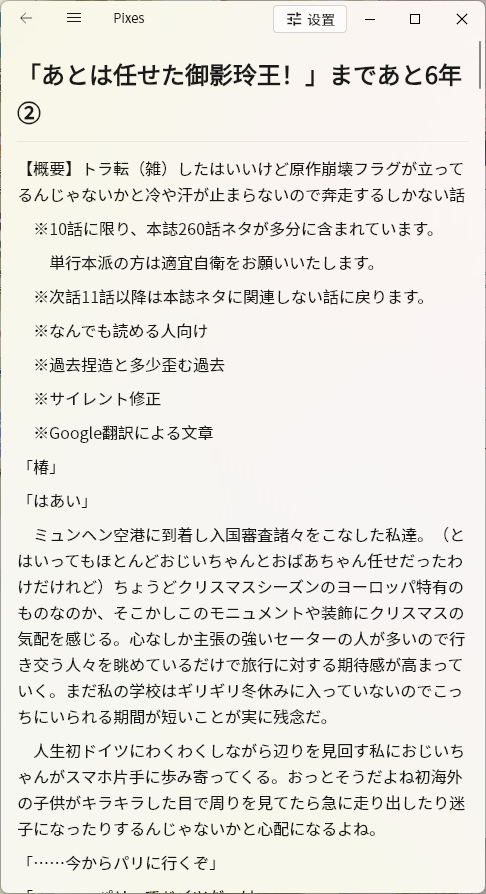
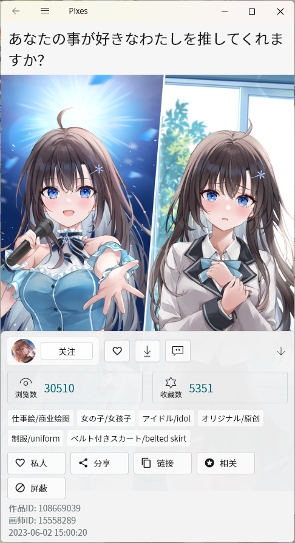
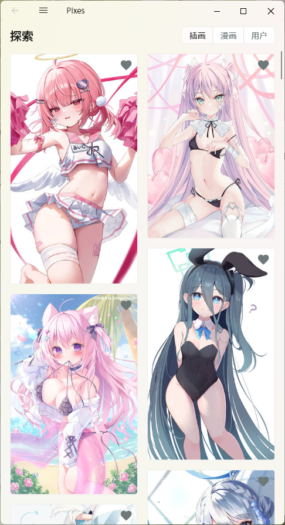

# pixes

 

非官方 Pixiv app, 支持 Windows, Android, iOS, macOS, linux

主要功能均已实现

## 下载

在 [Release](https://github.com/wgh136/pixes/releases) 页面下载

## 从源代码构建

### 准备工作

安装Stable版的Flutter

### 构建Android

将你的证书文件(`key.jks`, `key.properties`)放在`android`目录下

执行`flutter build apk`构建apk

### 构建iOS

执行`flutter build ios`构建iOS程序

### 构建Windows

执行`python windows/build_windows.py`构建Windows程序

### 构建macOS

执行`flutter build macos`构建macOS程序

### 构建Linux

执行`python3 debian/build.py`构建deb包

如果你使用其他发行版, 请注意`.desktop`文件中需要注册 URI Scheme `pixiv`

## 屏幕截图

